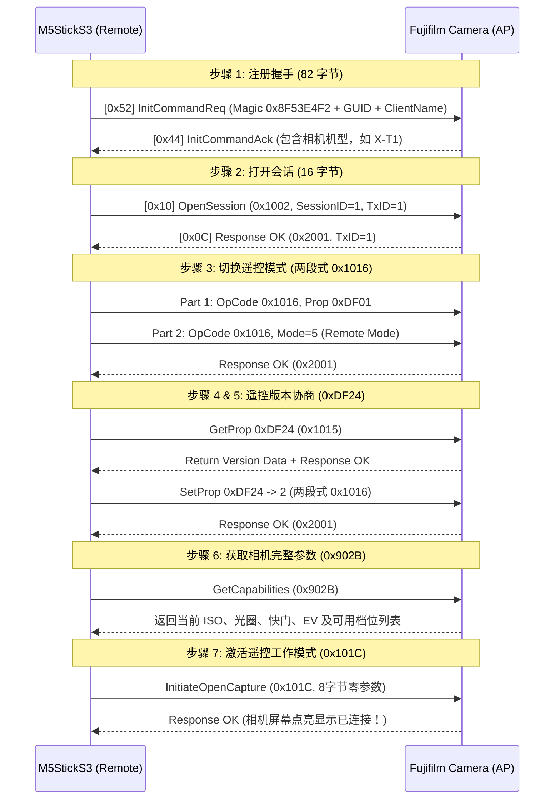

# 富士相机全功能智能遥控器 (Fujifilm Camera Smart Remote)

[中文](README.md) | [English](README_EN.md)

本项目为 **M5Stack StickS3 (ESP32-S3)** 打造的一款全功能富士相机无线智能遥控取景器。
突破传统蓝牙快门仅能触发拍照的限制，通过 **Wi-Fi 及富士私有 PTP/IP 协议** 深度打通相机的双向控制，实现**快门触发、曝光参数双向同步、IMU 体感重力调参以及基于硬件 SIMD 的高帧率 MJPEG 实时取景**。

---

## 🎯 核心特性

*   **硬件平台**: M5Stack StickS3 (ESP32-S3, 1.14寸 240×135 TFT 彩色屏幕, 内置 IMU 传感器, 板载 A/B 实体按键)。
*   **图形界面**: 基于 **LVGL 9** 构建的横屏参数仪表盘，实时高亮选中项。
*   **相机控制能力**:
    *   **快门触发 (Shutter Release)**: 毫秒级快速触发拍摄。
    *   **参数实时双向同步 (Exposure Control)**: 实时读取与调节 ISO、光圈 (Aperture)、快门速度 (Shutter Speed)、曝光补偿 (EV)。
    *   **IMU 体感重力调参 (Tilt-to-Adjust)**: 倾斜机身即可顺滑切换参数档位。
    *   **硬件加速实时取景 (SIMD Live View)**: 接收相机 55742 端口的 MJPEG 流，使用 ESP32-S3 乐鑫官方 **SIMD 矢量硬件解码器 (`esp_new_jpeg`)**，单帧解码低至 2.8ms，全屏居中裁切（100% 满高），支持水平镜像自拍翻转与悬浮无频闪 OSD。
*   **Wi-Fi 满速优化**: 强制关闭 ESP32 Wi-Fi 射频节能休眠（`WIFI_PS_NONE`）并启用 32KB Socket 接收缓冲，消除丢帧与网络延迟。

---

## 📷 支持机型矩阵 (Device Compatibility)

> ⚠️ **重要声明**：目前本项目**仅在富士 X-T1 上进行了完整真机开发与实测**。由于富士不同代际机型的无线通信协议差异极大，请参考下表了解兼容性状态：

| 兼容状态 | 机型代际 | 代表机型 | 连接方式与说明 |
| :--- | :--- | :--- | :--- |
| **✅ 已真机实测支持** | 经典初代 Wi-Fi 机型 | **Fujifilm X-T1** | 纯 Wi-Fi 直连（FUJIFILM Camera Remote 模式）。支持自动配对、快门触发、四项参数读取与双向修改、高帧率实时取景。 |
| **🟡 理论可能支持（未实测）** | 经典 Wi-Fi 时代同代机型 | **X-T10, X-T2, X-T20, X-E2, X-E2S, X-Pro2, X100T, X100F 等** | 理论上使用相同的旧版 Camera Remote Wi-Fi PTP/IP 协议规范，但因开发者手头无对应设备，**尚未进行真机联调与兼容性验证**。欢迎有设备的朋友协助测试并提交 PR。 |
| **❌ 暂不支持 / 协议不兼容** | 搭载蓝牙 (BLE) 及新一代 XApp 协议机型 | **X-T3, X-T4, X-T5, X-T30 / II, X-S10, X-S20, X-H2 / H2S, X100V, X100VI 等** | 较新款机型引入了低功耗蓝牙配对认证以及新版 **FUJIFILM XApp** 通信握手协议，与 X-T1 的旧版协议存在根本差异。**目前无法直接连接使用**。 |

> 📌 **关于蓝牙 (BLE) 功能的说明**：因我们当前测试的 X-T1 相机硬件本身不具备低功耗蓝牙模块，本项目目前**完全基于纯 Wi-Fi 链路**工作，固件暂未集成 BLE 配对流程。

---

## 🔍 富士 Wi-Fi PTP/IP 协议逆向与适配机制

通过对富士旧款机型 Wi-Fi 协议的深度逆向与分析（参考 [hkr/fuji-cam-wifi-tool](https://github.com/hkr/fuji-cam-wifi-tool) 等项目），我们攻克了富士相机在 Wi-Fi 通信中的一系列专有机制：

### 1. 富士私有报文头结构 (12 字节 vs 标准 18 字节)
标准 PTP/IP (ISO 15740) 使用 18 字节报文头。**富士 Wi-Fi 固件会严格丢弃标准 18 字节报文**，其私有封包结构如下：

```
+----------------+----------------+----------------+----------------+
|  Length (4B)   |   Index (2B)   |   OpCode (2B)  |   TxId (4B)    |
+----------------+----------------+----------------+----------------+
|                   Payload / Parameters (N 字节)                    |
+-------------------------------------------------------------------+
```
*   **Length (4 字节)**: 报文总长度（含自身 4 字节）。
*   **Index (2 字节)**: 阶段/序号标识（`1` = 请求/第一段，`2` = 第二段/数据，`3` = 相机响应）。
*   **OpCode / RespCode (2 字节)**: 操作码（如 `0x1002` 为 OpenSession，`0x2001` 为 ACK 成功）。
*   **TxId (4 字节)**: 事务自增 ID。

### 2. 通信端口体系
富士相机 Wi-Fi 启动后作为 AP（IP 通常为 `192.168.0.1`），开放以下端口：
*   **TCP 55740 (Command Port)**: 握手、指令下发、参数读取与设置。
*   **TCP 55741 (Event Port)**: 异步事件通道。
*   **TCP 55742 (LiveView Stream Port)**: 原始 MJPEG 实时取景数据流。

### 3. 完整的 7 步握手与遥控激活状态机
连接富士相机并非仅发送 `OpenSession`，必须顺序走完 7 步初始化流程，相机 LCD 才会点亮并进入遥控状态：



### 4. 两段式参数修改机制 (Two-Part Transaction)
修改曝光参数（如 ISO、光圈、快门）必须采用富士专属的两段式连续报文：
*   **第一段 (`Index = 1`)**: 发送操作码 `0x1016` (SetDevicePropValue) + 属性代码（如 `0xD02A` 为 ISO）。
*   **第二段 (`Index = 2`)**: 发送操作码 `0x1016` + 属性设定值。
*   相机校验两段内容后统一返回 `0x2001` (OK)。

### 5. 实时取景硬件解码与流控管线
*   **55742 取景流结构**: 每个数据包包含 4 字节包长 + 14 字节私有头部 + JPEG 图像数据。
*   **动态 SOI 探测**: 自动搜寻 `0xFF 0xD8` 标志，确保 100% 正确对齐图像数据。
*   **硬件 SIMD 解码**: 使用乐鑫专为 ESP32-S3 优化的 `esp_new_jpeg` 矢量汇编解码器，将 640×480 画面以 1/2 IDCT 硬件下采样解码为 320×240 RGB565（单帧耗时仅 2.8ms）。
*   **居中直推与 OSD 叠加**: Center-Crop 裁切填充 240×135 屏幕（垂直方向 100% 满高无黑边），并在双缓冲 Sprite 上叠加透明抗闪烁参数及 FPS 信息。

---

## 🎮 操作指南

### 1. 硬件按键定义 (横屏持握)

```
+---------------------------------------------------------+
| [FUJI REMOTE]                            SSID: X-T1-xxx |
| +---------------------+     +-------------------------+ |
| | ISO                 |     | Aperture                | |
| |                 400 |     |                    F2.8 | |
| +---------------------+     +-------------------------+ |
| +---------------------+     +-------------------------+ |
| | Shutter             |     | EV                      | |
| |              1/250s |     |                  +0.3EV | |
| +---------------------+     +-------------------------+ |
| [A]: Shoot                  [B]: LiveView [Hold B]: Tilt|
+---------------------------------------------------------+
       |                                   |
    [ 按键 A ]                          [ 按键 B ]
   (屏幕正面大按键)                    (侧边小按键)
```

*   **未连接 / 搜索状态**:
    *   **短按 [A]**: 扫描周边的富士相机 Wi-Fi AP，并自动发起连接。
    *   **短按 [B]**: 重置网络与连接状态。
*   **连接就绪状态 (READY 参数卡片页)**:
    *   **短按 [A]**: **触发快门拍照 (Shutter)** 📸。
    *   **短按 [B]**: 进入 **LiveView 实时取景模式** 📺。
    *   **长按 [B] (按住 0.6s)**: 进入 **IMU 重力感应体感调参模式**。
*   **LiveView 实时取景模式**:
    *   **短按 [A]**: 在取景画面下直接触发拍照 📸。
    *   **短按 [B]**: 返回参数仪表盘页面。
    *   **双击 [B]**: 切换**水平镜像翻转**（自拍取景神器）。
*   **IMU 体感调参模式**:
    *   **左右倾斜设备**: 依靠重力加速度计平滑增减参数数值。
    *   **短按 [A]**: 确认设定并保存。
    *   **短按 [B]**: 切换下一个调节参数项 (`ISO` -> `光圈` -> `快门` -> `EV`)。

---

## 🚀 编译与烧录

### 开发环境需求
*   **VSCode** + **PlatformIO IDE** 插件
*   固件框架: **Arduino-ESP32** (PlatformIO Espressif32 平台)

### 一键构建与烧录
```bash
# 编译固件
pio run -e m5stack-sticks3

# 烧录到 M5StickS3
pio run -e m5stack-sticks3 --target upload

# 打开串口监视器 (波特率 115200)
pio device monitor -b 115200
```

---

## 🗺️ 项目路线图 (Roadmap)

- [x] **阶段 1**: M5StickS3 基础环境、M5Unified 与 LVGL 9 图形系统集成。
- [x] **阶段 2**: 富士 Wi-Fi AP 自动扫描、握手与私有 PTP/IP 协议逆向重构。
- [x] **阶段 3**: 相机进入遥控状态机、快门控制、全参数 (ISO/光圈/快门/EV) 双向同步与 IMU 重力调参。
- [x] **阶段 4**: TCP 55742 MJPEG 实时取景流接收、ESP32-S3 SIMD 硬件解码与无频闪双缓冲全屏渲染。
- [ ] **阶段 5 (规划中)**: 新版 XApp 蓝牙 BLE 配对与新代际机型扩展研究。
- [ ] **阶段 6 (规划中)**: GPS 卫星地理标记注入（支持外接 UART GPS 模块，实现 1.5 秒快速连接注入经纬度后自动断开，相机免连线正常手持拍摄并自动为照片打标 EXIF）。

---

## 🙏 致谢与参考开源项目 (Acknowledgements & References)

本项目在逆向分析、协议解析与硬件架构设计过程中，深受以下开源项目的启发与帮助，特此致敬：

*   **[hkr/fuji-cam-wifi-tool](https://github.com/hkr/fuji-cam-wifi-tool)**: 极其出色的富士相机 Wi-Fi 协议逆向工程工具。为本项目破解富士私有 12 字节 PTP 报文头、7 步状态机握手序列、两段式参数修改（`0x1016`）及端口体系提供了决定性的关键线索。
*   **[sky18Dragon/RICOH-GR-Live-View-Shooting](https://github.com/sky18Dragon/RICOH-GR-Live-View-Shooting)**: 极具启发性的理光相机取景器项目。其社区通过 PR #12 / PR #14 探索出的 **ESP32-S3 `esp_new_jpeg` 硬件 SIMD 矢量解码加速架构**与 **RF 射频流控优化经验**，为本项目突破实时取景渲染延迟瓶颈提供了极具价值的技术参考。
*   **[petabyt/libfuji](https://github.com/petabyt/libfuji) & [petabyt/libpict](https://github.com/petabyt/libpict)**: 优秀的跨平台富士相机 PTP 协议通信库，提供了初始 82 字节 Magic 握手包结构与底层通信时序的重要参考。
*   **[akpm/furble](https://github.com/akpm/furble)**: 优秀的嵌入式无线相机遥控器项目，在硬件选型、交互设计及嵌入式低功耗控制方面为本项目提供了极具价值的设计灵感。
*   **[M5Unified](https://github.com/m5stack/M5Unified)**: M5Stack 官方统一硬件驱动层，为屏幕渲染与按键交互提供了坚实稳定的底座。
*   **[LVGL](https://github.com/lvgl/lvgl)**: 强大的开源轻量级嵌入式图形库。
