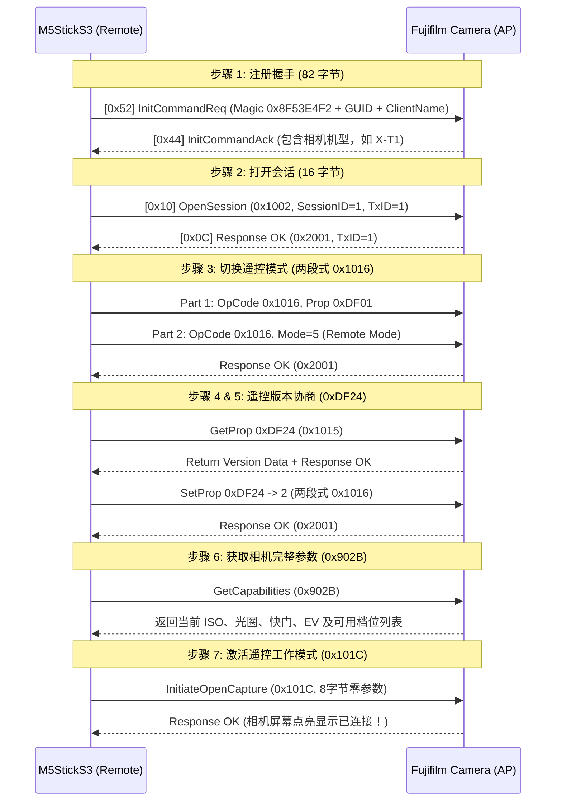

# 富士相机全功能智能遥控器 (Fujifilm Camera Smart Remote)

本项目为 **M5Stack StickS3 (ESP32-S3)** 打造的一款全功能富士相机无线智能遥控器。
突破传统蓝牙快门仅能触发拍照的限制，通过 **Wi-Fi 及富士私有 PTP/IP 协议** 深度打通相机的双向控制，实现**参数实时双向同步、快门触发、曝光步进调节与 MJPEG 实时取景**。

---

## 🎯 核心特性

*   **硬件平台**: M5Stack StickS3 (ESP32-S3, 1.14寸 240×135 TFT 彩色屏幕, 板载 A/B 实体按键)。
*   **图形界面**: 基于 **LVGL 9** 构建的横屏参数仪表盘，实时高亮选中项。
*   **相机控制能力**:
    *   **快门触发 (Shutter Release)**: 毫秒级快速触发拍摄。
    *   **参数实时双向同步 (Exposure Control)**: 实时读取与调节 ISO、光圈 (Aperture)、快门速度 (Shutter Speed)、曝光补偿 (EV)。
    *   **实时取景 (Live View - 进行中)**: 接收相机 55742 端口的 MJPEG 视频流并实时解码显示。
*   **多品牌架构 (Multi-brand Ready)**: 面向对象的 `CameraDevice` 统一抽象层，便于扩展索尼 (Sony)、佳能 (Canon) 等品牌。

---

## 🔍 富士 Wi-Fi PTP/IP 协议逆向与适配记录 (Key Findings)

通过对富士旧款及全系列机型 Wi-Fi 协议的深度逆向与分析（参考 [hkr/fuji-cam-wifi-tool](https://github.com/hkr/fuji-cam-wifi-tool) 等项目），我们攻克了富士相机在 Wi-Fi 通信中的一系列专有机制：

### 1. 富士私有报文头结构 (12 字节 vs 标准 18 字节)
标准 PTP/IP (ISO 15740) 使用 18 字节报文头，包含 4 字节的包类型 (PacketType) 与 4 字节的数据阶段 (DataPhase)。**富士 Wi-Fi 固件会严格丢弃标准 18 字节报文**，其私有封包结构如下：

```
+----------------+----------------+----------------+----------------+
|  Length (4B)   |   Index (2B)   |   OpCode (2B)  |   TxId (4B)    |
+----------------+----------------+----------------+----------------+
|                   Payload / Parameters (N 字节)                    |
+-------------------------------------------------------------------+
```
*   **Length (4 字节)**: 报文总长度（含自身 4 字节）。
*   **Index (2 字节)**: 阶段/序号标识（`1` = 请求/第一段，`2` = 第二段/数据，`3` = 相机响应）。
*   **OpCode / RespCode (2 字节)**: 操作码（如 `0x1002` 为 OpenSession，`0x2001` 为 ACK 成功）。
*   **TxId (4 字节)**: 事务自增 ID。

### 2. 通信端口体系
富士相机 Wi-Fi 启动后作为 AP（IP 通常为 `192.168.0.1`），开放以下端口：
*   **TCP 55740 (Command Port)**: 握手、指令下发、参数读取与设置。
*   **TCP 55741 (Event Port)**: 异步事件通道。
*   **TCP 55742 (LiveView Stream Port)**: 原始 MJPEG 实时取景数据流。

### 3. 完整的 7 步握手与遥控激活状态机
连接富士相机并非仅发送 `OpenSession`，必须顺序走完 7 步初始化流程，相机 LCD 才会点亮并进入遥控状态：



### 4. 两段式参数修改机制 (Two-Part Transaction)
修改曝光参数（如 ISO、光圈、快门）必须采用富士专属的两段式连续报文：
*   **第一段 (`Index = 1`)**: 发送操作码 `0x1016` (SetDevicePropValue) + 属性代码（如 `0xD02A` 为 ISO）。
*   **第二段 (`Index = 2`)**: 发送操作码 `0x1016` + 属性设定值。
*   相机校验两段内容后统一返回 `0x2001` (OK)。

### 5. TCP 单包合并发送机制
ESP32 WiFiClient 在默认开启 `TCP_NODELAY` 时，若将包头与数据分多次 `write()` 发送，会被拆分成多个 TCP 数据段。富士相机固件检测到非整包即会丢弃并引发超时。因此所有 PTP 数据包在发送前均在内存中合并为单缓冲区一次性写入 socket。

---

## 📷 支持机型矩阵

| 机型代际 | 代表机型 | 连接模式 | 支持功能 |
| :--- | :--- | :--- | :--- |
| **经典 Wi-Fi 机型** | X-T1, X-T2, X-T10, X-T20, X-E2, X-E3, X-Pro2, X100F 等 | Wi-Fi 直连 (Camera Remote 模式) | ✅ 自动配对、快门控制、全参数读取与设置、实时取景 |
| **现代 BLE+Wi-Fi 机型** | X-T3, X-T4, X-T5, X-T30, X-S10, X-H2, X100V, X100VI 等 | Wi-Fi 遥控模式 / XApp 模式 | ✅ Wi-Fi 遥控底层协议完全通用 |

---

## 🎮 操作指南

### 1. 硬件按键定义 (横屏持握)

```
+---------------------------------------------------------+
| [FUJI REMOTE]                            SSID: X-T1-xxx |
| +---------------------+     +-------------------------+ |
| | ISO                 |     | Aperture                | |
| |                 400 |     |                    F2.8 | |
| +---------------------+     +-------------------------+ |
| +---------------------+     +-------------------------+ |
| | Shutter             |     | EV                      | |
| |              1/250s |     |                  +0.3EV | |
| +---------------------+     +-------------------------+ |
| [A]: Shoot                  [B]: Select  [Hold B]: Val+ |
+---------------------------------------------------------+
       |                                   |
    [ 按键 A ]                          [ 按键 B ]
   (屏幕正面大按键)                    (侧边小按键)
```

*   **未连接状态**:
    *   **短按 [A]**: 扫描周边的富士相机 Wi-Fi AP，并自动发起连接。
    *   **短按 [B]**: 重置网络与连接状态。
*   **连接就绪状态 (READY)**:
    *   **短按 [A]**: **触发快门拍照 (Shutter)** 📸。
    *   **短按 [B]**: 轮流切换选中的参数项 (`ISO` -> `Aperture` -> `Shutter` -> `EV`)。
    *   **长按 [B] (按住 0.6s)**: 将当前选中的参数项步进递增 +1 档。

---

## 🚀 编译与烧录

### 开发环境需求
*   **VSCode** + **PlatformIO IDE** 插件
*   固件框架: **Arduino-ESP32** (PlatformIO Espressif32 平台)

### 一键构建与烧录
```bash
# 编译固件
pio run -e m5stack-sticks3

# 烧录到 M5StickS3
pio run -e m5stack-sticks3 --target upload

# 打开串口监视器 (波特率 115200)
pio device monitor -b 115200
```

---

## 🗺️ 项目路线图 (Roadmap)

- [x] **阶段 1**: M5StickS3 基础环境、M5Unified 与 LVGL 9 图形系统集成。
- [x] **阶段 2**: 富士 Wi-Fi AP 自动扫描、握手与私有 PTP/IP 协议逆向重构。
- [x] **阶段 3**: 相机进入遥控状态机、快门控制、全参数 (ISO/光圈/快门/EV) 双向同步。
- [x] **UI 优化**: 横屏 (240×135) 适配与 2×2 参数仪表盘高亮交互。
- [ ] **阶段 4**: TCP 55742 MJPEG 实时取景解码渲染与小屏幕高帧率刷新优化。
- [ ] **阶段 5**: `CameraDevice` 多品牌扩展（索尼/佳能/松下等）与蓝牙 BLE 低功耗唤醒。
- [ ] **阶段 6 (规划中)**: GPS 卫星地理标记注入（支持外接 UART GPS 模块，实现 1.5 秒快速连接注入经纬度后自动断开，相机免连线正常手持拍摄并自动为照片打标 EXIF）。

---

## 🙏 致谢与参考开源项目 (Acknowledgements & References)

本项目在逆向分析、协议解析与硬件架构设计过程中，深受以下开源项目的启发与帮助，特此致敬：

*   **[hkr/fuji-cam-wifi-tool](https://github.com/hkr/fuji-cam-wifi-tool)**: 极其出色的富士相机 Wi-Fi 协议逆向工程工具。为本项目破解富士私有 12 字节 PTP 报文头、7 步状态机握手序列、两段式参数修改（`0x1016`）及端口体系提供了决定性的关键线索。
*   **[petabyt/libfuji](https://github.com/petabyt/libfuji) & [petabyt/libpict](https://github.com/petabyt/libpict)**: 优秀的跨平台富士相机 PTP 协议通信库，提供了初始 82 字节 Magic 握手包结构与底层通信时序的重要参考。
*   **[akpm/furble](https://github.com/akpm/furble)**: 优秀的嵌入式无线相机遥控器项目，在硬件选型、交互设计及嵌入式低功耗控制方面为本项目提供了极具价值的设计灵感。
*   **[M5Unified](https://github.com/m5stack/M5Unified)**: M5Stack 官方统一硬件驱动层，为屏幕渲染与按键交互提供了坚实稳定的底座。
*   **[LVGL](https://github.com/lvgl/lvgl)**: 强大的开源轻量级嵌入式图形库。
