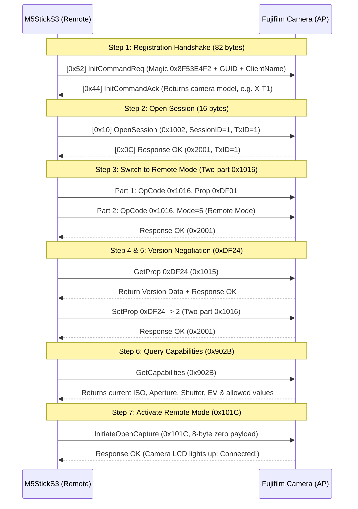

# Fujifilm Camera Smart Remote & Viewfinder

[English](README_EN.md) | [中文](README.md)

A feature-rich wireless smart remote controller and viewfinder designed for **M5Stack StickS3 (ESP32-S3)** and Fujifilm cameras.
Unlike traditional Bluetooth remotes that can only trigger the shutter, this project establishes deep bi-directional control over **Wi-Fi and Fujifilm's proprietary PTP/IP protocol**, supporting **sub-second shutter release, real-time exposure parameter synchronization, IMU gravity-sensing parameter adjustment, and high-framerate hardware-accelerated MJPEG Live View**.

---

## 🎯 Key Features

*   **Hardware Platform**: M5Stack StickS3 (ESP32-S3, 1.14" 240×135 TFT color display, built-in 6-axis IMU, on-board A/B tactile buttons).
*   **User Interface**: Custom landscape parameter dashboard powered by **LVGL 9** with active parameter card highlighting.
*   **Camera Control Capabilities**:
    *   **Shutter Release**: Instant, low-latency capture triggering.
    *   **Bi-directional Exposure Control**: Real-time reading and setting of ISO, Aperture, Shutter Speed, and Exposure Compensation (EV).
    *   **IMU Motion Parameter Adjustment (Tilt-to-Adjust)**: Smoothly step through parameter values simply by tilting the device left or right.
    *   **Hardware-Accelerated Live View (SIMD)**: Streams MJPEG frames from TCP port 55742 and decodes via Espressif's official **ESP32-S3 SIMD vector assembly decoder (`esp_new_jpeg`)** in ~2.8ms per frame. Renders at full 100% display height with double-buffered DMA zero-flicker OSD and horizontal selfie mirror flip.
*   **Maximum Wi-Fi Throughput**: Disables 802.11 modem sleep (`WIFI_PS_NONE`) and enforces a 32KB socket receive buffer to eliminate packet stutter and frame dropping.

---

## 📷 Device Compatibility Matrix

> ⚠️ **Important Notice**: This project has been developed and verified **exclusively on the Fujifilm X-T1**. Due to significant protocol shifts across Fujifilm camera generations, please consult the compatibility matrix below:

| Status | Generation | Representative Models | Connection Method & Details |
| :--- | :--- | :--- | :--- |
| **✅ Verified & Supported** | Classic 1st-Gen Wi-Fi Cameras | **Fujifilm X-T1** | Pure Wi-Fi Direct (FUJIFILM Camera Remote mode). Fully supports auto-pairing, shutter triggering, 4-way exposure reading/modification, and high-FPS Live View. |
| **🟡 Theoretically Compatible (Untested)** | Classic Wi-Fi Era Sibling Models | **X-T10, X-T2, X-T20, X-E2, X-E2S, X-Pro2, X100T, X100F, etc.** | In theory, these share the same legacy Camera Remote Wi-Fi PTP/IP protocol specification. However, since the maintainer does not possess these devices, **they have not been verified on real hardware**. Community testing and PRs are welcome. |
| **❌ Unsupported / Different Protocol** | Modern BLE & XApp Generation Cameras | **X-T3, X-T4, X-T5, X-T30 / II, X-S10, X-S20, X-H2 / H2S, X100V, X100VI, etc.** | Newer cameras introduced mandatory Bluetooth Low Energy pairing authentication and the modern **FUJIFILM XApp** communication protocol, which differs fundamentally from the X-T1 legacy protocol. **These models cannot connect directly at this time.** |

> 📌 **Note on Bluetooth (BLE)**: Because the tested Fujifilm X-T1 hardware lacks a Bluetooth Low Energy module, this firmware operates **purely over Wi-Fi direct link**, and BLE pairing flows are currently unassisted.

---

## 🔍 Reverse Engineering: Fujifilm Wi-Fi PTP/IP Protocol

Through in-depth protocol reverse engineering (referencing projects like [hkr/fuji-cam-wifi-tool](https://github.com/hkr/fuji-cam-wifi-tool)), we uncovered several proprietary mechanisms required by Fujifilm Wi-Fi camera firmware:

### 1. Proprietary 12-byte Header (vs Standard 18-byte PTP/IP)
Standard PTP/IP (ISO 15740) uses an 18-byte header containing PacketType and DataPhase fields. **Fujifilm Wi-Fi firmware strictly drops standard 18-byte packets**, requiring a custom 12-byte header:

```
+----------------+----------------+----------------+----------------+
|  Length (4B)   |   Index (2B)   |   OpCode (2B)  |   TxId (4B)    |
+----------------+----------------+----------------+----------------+
|                   Payload / Parameters (N bytes)                   |
+-------------------------------------------------------------------+
```
*   **Length (4 bytes)**: Total message length including the header.
*   **Index (2 bytes)**: Phase/Sequence identifier (`1` = Request/Part 1, `2` = Part 2/Data, `3` = Camera Response).
*   **OpCode / RespCode (2 bytes)**: Operation code (e.g. `0x1002` for OpenSession, `0x2001` for ACK OK).
*   **TxId (4 bytes)**: Incrementing Transaction ID.

### 2. Port Architecture
Upon Wi-Fi activation, the camera creates an Access Point (typically `192.168.0.1`) exposing three primary TCP ports:
*   **TCP 55740 (Command Port)**: Handshake, RPC commands, exposure parameter get/set.
*   **TCP 55741 (Event Port)**: Asynchronous event notifications.
*   **TCP 55742 (LiveView Stream Port)**: Raw continuous MJPEG video stream.

### 3. 7-Step Handshake & Remote Control State Machine
Connecting to a Fujifilm camera requires executing a strict 7-step sequence before the camera LCD activates remote mode:



### 4. Two-Part Transaction for Parameter Setting
Modifying exposure parameters (ISO, Aperture, Shutter Speed, EV) requires two consecutive packets:
*   **Part 1 (`Index = 1`)**: OpCode `0x1016` (SetDevicePropValue) + Target Property Code (e.g. `0xD02A` for ISO).
*   **Part 2 (`Index = 2`)**: OpCode `0x1016` + New Parameter Value.
*   The camera verifies both parts and returns `0x2001` (OK).

### 5. Hardware SIMD Live View & Stream Pipeline
*   **Port 55742 Stream Format**: 4-byte total length prefix + 14-byte private header + JPEG payload.
*   **Dynamic SOI Marker Search**: Locates `0xFF 0xD8` markers dynamically to guarantee frame integrity.
*   **Hardware SIMD IDCT Decoder**: Powered by Espressif's `esp_new_jpeg` assembly library, decoding 640×480 MJPEG down to 320×240 RGB565 in just **2.8ms**.
*   **Center-Crop Direct Push**: Direct line `memcpy` into the 240×135 canvas (100% height fill with zero vertical letterboxing) with transparent floating OSD and 1-shot DMA screen refresh.

---

## 🎮 User Guide & Controls

### 1. Button Layout (Landscape Orientation)

```
+---------------------------------------------------------+
| [FUJI REMOTE]                            SSID: X-T1-xxx |
| +---------------------+     +-------------------------+ |
| | ISO                 |     | Aperture                | |
| |                 400 |     |                    F2.8 | |
| +---------------------+     +-------------------------+ |
| +---------------------+     +-------------------------+ |
| | Shutter             |     | EV                      | |
| |              1/250s |     |                  +0.3EV | |
| +---------------------+     +-------------------------+ |
| [A]: Shoot                  [B]: LiveView [Hold B]: Tilt|
+---------------------------------------------------------+
       |                                   |
   [ Button A ]                        [ Button B ]
  (Front Main Key)                    (Side Small Key)
```

*   **Scanning / Disconnected State**:
    *   **Short Press [A]**: Scan for nearby Fujifilm camera Wi-Fi APs and connect automatically.
    *   **Short Press [B]**: Reset network and connection state.
*   **Connected & Ready State (Parameter Dashboard)**:
    *   **Short Press [A]**: **Trigger Shutter (Capture Photo)** 📸.
    *   **Short Press [B]**: Enter **LiveView Viewfinder Mode** 📺.
    *   **Long Press [B] (Hold 0.6s)**: Enter **IMU Motion Parameter Adjustment Mode**.
*   **LiveView Viewfinder Mode**:
    *   **Short Press [A]**: Trigger shutter directly while previewing 📸.
    *   **Short Press [B]**: Return to Parameter Dashboard.
    *   **Double Press [B]**: Toggle **Horizontal Mirror Flip** (Selfie Viewfinder mode).
*   **IMU Motion Adjustment Mode**:
    *   **Tilt Device Left / Right**: Smoothly increase or decrease the active parameter value.
    *   **Short Press [A]**: Confirm and apply setting to camera.
    *   **Short Press [B]**: Cycle to next parameter (`ISO` -> `Aperture` -> `Shutter` -> `EV`).

---

## 🚀 Build and Flash

### Prerequisites
*   **VSCode** + **PlatformIO IDE** extension
*   Framework: **Arduino-ESP32** (PlatformIO Espressif32 platform)

### Build & Upload Commands
```bash
# Build firmware
pio run -e m5stack-sticks3

# Flash firmware to M5StickS3
pio run -e m5stack-sticks3 --target upload

# Open serial monitor (Baud rate: 115200)
pio device monitor -b 115200
```

---

## 🗺️ Roadmap

- [x] **Phase 1**: M5StickS3 setup, M5Unified HAL, and LVGL 9 display framework integration.
- [x] **Phase 2**: Fujifilm Wi-Fi AP auto-discovery, connection, and proprietary PTP/IP reverse engineering.
- [x] **Phase 3**: Camera remote state machine, shutter release, bi-directional exposure control, and IMU motion adjustment.
- [x] **Phase 4**: TCP 55742 MJPEG streaming with ESP32-S3 SIMD hardware decoding and zero-flicker double-buffered rendering.
- [ ] **Phase 5 (Planned)**: Research into modern XApp BLE pairing and next-gen camera protocol expansion.
- [ ] **Phase 6 (Planned)**: GPS Satellite Geotagging Injection (supports external UART GPS module, quick 1.5s connection to inject coordinates and disconnect, enabling wireless EXIF geotagging during handheld shooting).

---

## 🙏 Acknowledgements & References

This project was made possible thanks to research and design patterns from the following open-source projects:

*   **[hkr/fuji-cam-wifi-tool](https://github.com/hkr/fuji-cam-wifi-tool)**: Exceptional Fujifilm Wi-Fi reverse-engineering tool. Provided crucial insights into the 12-byte PTP header, 7-step handshake sequence, two-part property transactions (`0x1016`), and port architecture.
*   **[sky18Dragon/RICOH-GR-Live-View-Shooting](https://github.com/sky18Dragon/RICOH-GR-Live-View-Shooting)**: Inspiring Ricoh GR viewfinder project. Its community research (PR #12 / PR #14) on **ESP32-S3 `esp_new_jpeg` hardware SIMD decoding** and **RF coexistence optimization** provided indispensable technical references.
*   **[petabyt/libfuji](https://github.com/petabyt/libfuji) & [petabyt/libpict](https://github.com/petabyt/libpict)**: High-quality cross-platform Fujifilm PTP libraries providing valuable references for initial 82-byte magic registration packets and timing.
*   **[akpm/furble](https://github.com/akpm/furble)**: Excellent camera remote project that inspired embedded low-power and hardware interaction designs.
*   **[M5Unified](https://github.com/m5stack/M5Unified)**: Standard M5Stack hardware abstraction layer for reliable display and button control.
*   **[LVGL](https://github.com/lvgl/lvgl)**: Versatile and lightweight embedded graphics library.
