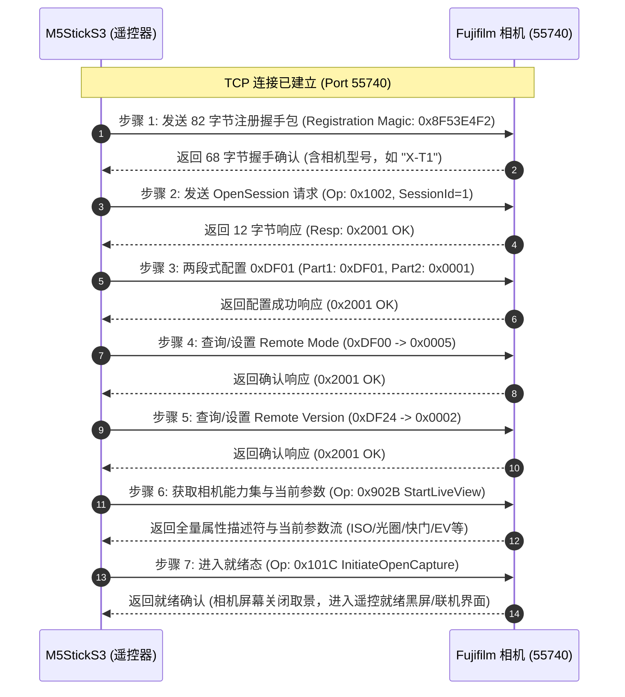

# 富士胶片相机 Wi-Fi PTP/IP 协议逆向技术规范 (Fujifilm Wi-Fi PTP/IP Protocol Specification)

本文档系统性归纳了富士无反相机（包括 X-T 系列、X-Pro 系列、X-E 系列、X-Txx 系列、X100 系列等）在 Wi-Fi 遥控连接模式下的私有通信协议、握手时序、控制指令集及实时取景视频流格式。

---

## 1. 网络架构与端口定义 (Network Architecture & Ports)

当相机开启 Wi-Fi 遥控模式时，相机会创建一个专有无线局域网接入点（SoftAP），网关 IP 通常为 `192.168.0.1`。
相机在 TCP 层监听以下三个核心通信端口：

| 端口号 (Port) | 服务类型 | 传输协议 | 作用与功能说明 |
| :--- | :--- | :--- | :--- |
| **55740** | **命令控制通道 (Command Channel)** | TCP | 主控制连接，用于握手注册、Session 管理、拍照触发、参数读写。 |
| **55741** | **异步事件通道 (Event Channel)** | TCP | 接收相机主动推送的事件通知（如对焦锁定、拍摄完成、电量变动）。 |
| **55742** | **实时取景通道 (LiveView Stream)** | TCP | 相机实时取景画面传输通道，持续输出 MJPEG 格式的视频图像帧。 |

---

## 2. 富士私有报文头结构 (Packet Header Layout)

> [!IMPORTANT]
> 富士相机在 Wi-Fi 模式下**不使用** ISO 15740 标准的 18 字节 PTP/IP 头部，而是采用**自研的 12 字节私有头部**。如果向相机发送 18 字节标准包，相机固件将无法识别并导致通信超时。

### 报文格式布局（12 字节）

```
 0                   1                   2                   3
 0 1 2 3 4 5 6 7 8 9 0 1 2 3 4 5 6 7 8 9 0 1 2 3 4 5 6 7 8 9 0 1
+-+-+-+-+-+-+-+-+-+-+-+-+-+-+-+-+-+-+-+-+-+-+-+-+-+-+-+-+-+-+-+-+
|                      Length (4 字节, LE)                       |
+-+-+-+-+-+-+-+-+-+-+-+-+-+-+-+-+-+-+-+-+-+-+-+-+-+-+-+-+-+-+-+-+
|         Index (2 字节)        |        OpCode (2 字节)        |
+-+-+-+-+-+-+-+-+-+-+-+-+-+-+-+-+-+-+-+-+-+-+-+-+-+-+-+-+-+-+-+-+
|                    Transaction ID (4 字节, LE)                |
+-+-+-+-+-+-+-+-+-+-+-+-+-+-+-+-+-+-+-+-+-+-+-+-+-+-+-+-+-+-+-+-+
|                     Payload / 数据载荷 (N 字节)                 |
+-+-+-+-+-+-+-+-+-+-+-+-+-+-+-+-+-+-+-+-+-+-+-+-+-+-+-+-+-+-+-+-+
```

### 字段说明：
1. **Length (4 Bytes, Little-Endian)**：整个报文的总字节数（包含头部 12 字节以及后续 Payload 的长度）。
2. **Index (2 Bytes, Little-Endian)**：
   * `0x0001`：**客户端请求指令包 (Request / Operation)**
   * `0x0002`：**相机数据载荷包 (Data Phase Payload)**
   * `0x0003`：**相机响应状态包 (Response / Completion Code)**
3. **OpCode / RespCode (2 Bytes, Little-Endian)**：
   * 请求包中：PTP 操作代码（如 `0x1002` 表示 OpenSession）。
   * 响应包中：返回状态码（`0x2001` 表示 `PTP_RC_OK` 成功，其它为错误码）。
4. **Transaction ID (4 Bytes, Little-Endian)**：
   * 事务流水号，从 `1` 开始递增，响应包中的 `txId` 必须与请求包严格一致。

---

## 3. 遥控连接 7 步握手状态机 (7-Step Handshake Sequence)

建立 TCP 55740 连接后，必须严格按照以下顺序执行握手序列，相机才会点亮屏幕并切换至遥控状态：



---

## 4. 关键控制指令集 (PTP Operation Codes)

| 操作码 (OpCode) | 名称 | 数据流方向 | 说明 |
| :--- | :--- | :--- | :--- |
| `0x1002` | `OpenSession` | Client -> Camera | 开启通信会话，参数通常为 `0x00000001`。 |
| `0x1003` | `CloseSession` | Client -> Camera | 关闭会话。 |
| `0x100E` | `InitiateCapture` | Client -> Camera | **触发快门拍照** 📸。 |
| `0x1015` | `GetDevicePropValue` | Client -> Camera -> Client | 获取指定单项属性的当前值。 |
| `0x1016` | `SetDevicePropValue` | Client -> Camera (两段式) | **设置相机曝光参数**。 |
| `0x101C` | `InitiateOpenCapture` | Client -> Camera | 启动远程捕获控制模式。 |
| `0x902B` | `FujiGetCapabilities` | Client -> Camera -> Client | 获取相机支持的全量属性定义与取景准备。 |
| `0x902C` | `FujiShutterStepDown` | Client -> Camera | 快门速度递减 1 档。 |
| `0x902D` | `FujiShutterStepUp` | Client -> Camera | 快门速度递增 1 档。 |
| `0x902E` | `FujiApertureStep` | Client -> Camera | 光圈步进调节。 |

---

## 5. 两段式参数设置机制 (Two-Part Property Setting)

当向相机写入参数（OpCode `0x1016`）时，富士协议强制使用“两段式连续报文”：

1. **第一段报文 (Part 1 - 属性标识)**：
   * Payload 长度：4 字节
   * 格式：`[PropertyCode: 2 字节][0x00, 0x00: 2 字节]`
2. **第二段报文 (Part 2 - 目标数值)**：
   * Payload 长度：依数据类型而定（2 字节或 4 字节）
   * 格式：`[TargetValue: 2/4 字节]`
3. 相机在完整接收到两段报文后，返回最终响应包 `0x2001 (OK)`。

---

## 6. 富士相机核心属性代码映射表 (Device Property Codes)

| 属性代码 (Hex) | 属性名称 | 数据类型 | 编码格式与计算规则 |
| :--- | :--- | :--- | :--- |
| `0xD02A` | **ISO 感光度** | uint32 | * 最高位 `0x80000000` 表示 Auto ISO。<br>* 低位为真实 ISO 数值（如 `200`、`400`、`6400`）。 |
| `0x5007` | **光圈值 (Aperture)** | uint16 | * 百倍 F 值编码（如 `280` 代表 `F2.8`，`560` 代表 `F5.6`）。<br>* `0xFFFF` 表示自动/未知。 |
| `0xD240` | **快门速度 (Shutter)** | uint32 | * 最高位 `0x80000000` 表示分数秒标志（Subsecond）。<br>* `数值 / 1000.0` 计算实际秒数（如 `0x8003D090` 即 `1/250s`）。 |
| `0x5010` | **曝光补偿 (EV)** | int16 | * 千分之一 EV（毫 EV 编码）。<br>* 如 `+333` = `+0.3 EV`，`-1000` = `-1.0 EV`，`0` = `0.0 EV`。 |
| `0x5005` | **白平衡 (WB)** | uint16 | `0x0002`: Auto, `0x0004`: Daylight, `0x8001`: Custom, `0x8002`: Kelvin。 |
| `0xD001` | **胶片模拟 (Film Sim)** | uint16 | `0x0001`: Provia, `0x0002`: Velvia, `0x0003`: Astia, `0x0004`: Classic Chrome 等。 |
| `0xD242` | **电池电量 (Battery)** | uint16 | `0x0000`: 极低, `0x0001`~`0x0004`: 1~4 格, `0x0005`: 满电。 |

---

## 7. 实时取景 MJPEG 视频流规范 (Port 55742)

相机在 TCP 55742 端口持续广播实时取景流：

1. **连接建立**：客户端直接连接 `Camera_IP:55742`，无需 HTTP GET 头。
2. **数据流格式**：纯二进制连续 JPEG 图像帧数据流。
3. **帧边界识别**：
   * **帧起始符 (SOI)**：`0xFF, 0xD8`
   * **帧结束符 (EOI)**：`0xFF, 0xD9`
4. **解码渲染要求**：
   * 帧率：约 15 ~ 30 FPS。
   * 图像分辨率：约 640×480（4:3）或 640×360（16:9）。
   * 嵌入式屏幕缩放适配：M5StickS3（240×135）通过硬件 JPEG 快速解码至 PSRAM 帧缓冲区，按 3:2 居中等比缩放显示。
